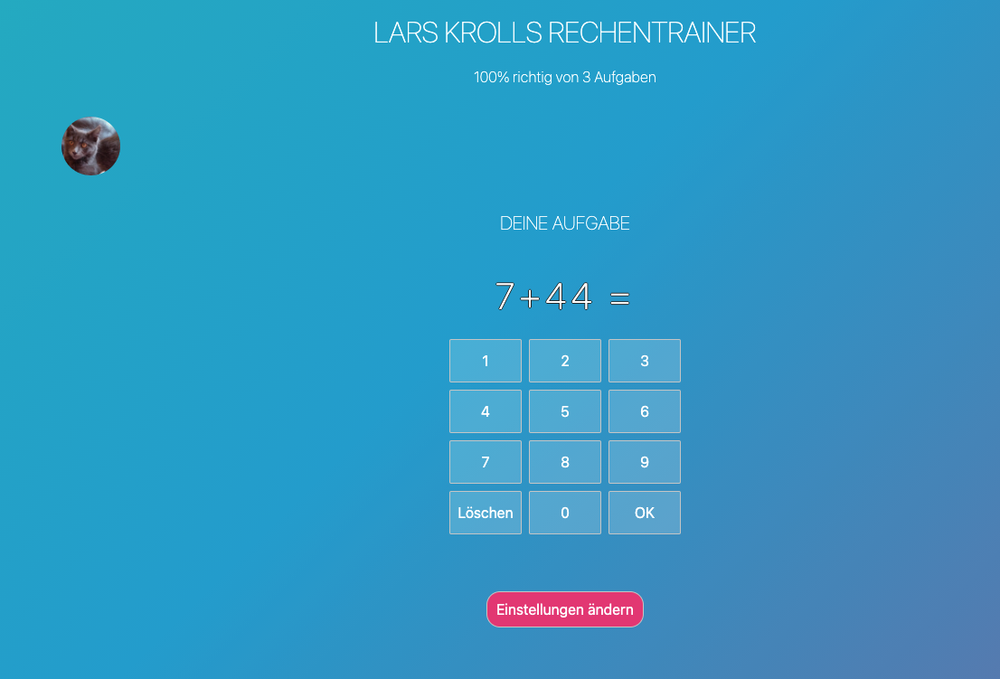

# Coolrechnen Rechentrainer Web App

Demonstrator einer einfachen Web-App zum Erlernen der Grundrechenarten für Kinder. Die App erzeugt zufällige Rechenaufgaben einer vorgegebenen Rechenart und eines Zahlenraumes. Die Kinder bekommen ein Feedback zum Erfolg beim Lösen der Aufgaben. Die App wurde mit svelte.js erstellt. Der Quellcode ist über github verfügbar.

**[Link zur App](https://coolrechnen.vercel.app/)**

## Screenshot

## Features

Dieses App bietet einen einfachen Weg das 1x1 zu üben. Die App unterstützt 
- alle vier Grundrechenarten 
- Zahlenräume bis
  10
  20
  50
  100
- Einfache Erfolgskontrolle über Tierbilder für Kinder und Angaben zur Zahl der bearbeiteten Aufgaben inkl. Anteil richtiger Aufgaben für Kinder. 

Die App wird ohne Gewähr als Technologiedemonstrator bereitgestellt. 

# Datenschutz

Die App ist ein Demonstrator zum testen. Die App wird zur Evaluation bereitgestellt. Zu diesem Zweck sind die Dienste [vercel.com](https://www.vercel.com) (App Hosting) und *[loremflickr.com](https://www.loremflickr.com)* (Zufallsbilder nach Themen) eingebunden. Mit der Nutzung werden die Datenschutzinformationen der beidne Dienste akzeptiert. Die App selbst speichert keine Informationen in der Cloud. 

Alle Informationen der Nutzenden werden nur lokal im Browser gespeichert.
